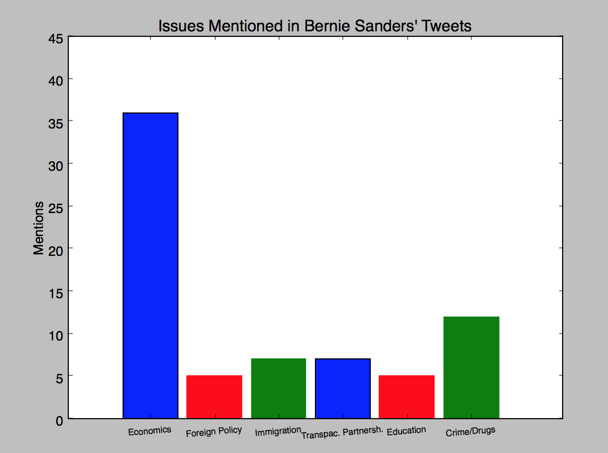
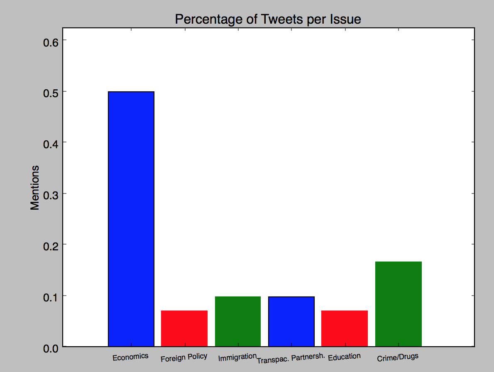

Uses <a href="https://github.com/twitter/twurl">Twurl</a> to pull tweets from a twitter user, counts instances of keywords and uses matplotlib.pyplot to graph them. 
twurl via subprocess is the simplest way to do this now that the API requires OAuth.

---
####News 
Django-powered implementation in the works as of 10/26/15. Screennames will be opened up to user input, which presents a few problems:
+ subprocess shouldn't be used with user input (security), so can't utilize twurl's easy OAuth authentication. 
+ will use urllib likely, and PHP to OAuth?

Other problems:
+ displaying the matplotlib-generated graph as an image presents difficulties
  + Seems easiest to save the image with savefig() but this requires storage, if multiple requests are sent at the same time, which image to show? etc.

---

#####Usage
Setting up twurl just requires you make an application on twitter (to get a consumer key and secret) and then
follow twurl's instructions for OAuth authentication.

Read about the <a href="https://dev.twitter.com/rest/reference/get/statuses/user_timeline">Twitter API</a> (specifically what this project uses).

The keywords are specifically geared towards politicians (specifically Bernie Sanders was the tested user); hope to add the ability to change *keywords* in config file but otherwise can change them in *twitterGraph.py*.

Use config file to set the username, the number of pages of tweets you want to search, and whether or not to plot the graph as percentages of tweets or just number.

#####Output

        
        
        </img>

Yes, the graphs look identical. The difference is just that the PMF is a better way of conveying the information
(as ratios over total). The ratios do, in fact, add up to 1.0.

Graph no longer has "Bernie Sanders" in the name as it can now be for any user.

